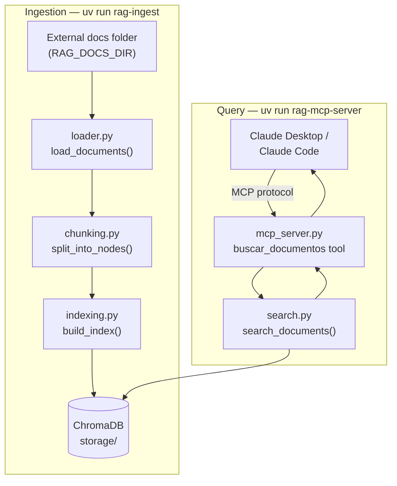

# rag-study

**Language:** **English** (default) | [Português](README.pt-BR.md)

## Summary

`rag-study` is a personal RAG (Retrieval-Augmented Generation) study project and, at the same time, a real tool: a local **MCP server** that lets Claude (Desktop and Claude Code) semantically search a personal document folder — mostly PDFs — using local embeddings and a local vector database.

The project has two goals at once:

- **Learn** modern Python tooling and the core mechanics of a RAG pipeline (document loading, chunking, embeddings, vector search) by building each piece from scratch instead of hiding it behind a black-box framework call.
- **Be useful** day to day: ask Claude questions about your own documents, grounded in real excerpts with the source file cited.

**No code in this project calls the paid Anthropic API.** The only integration point with Claude is the MCP protocol — the Claude Desktop/Claude Code subscription you already pay for is what consumes the tool this server exposes.

## Tech Stack

| Layer | Choice | Why |
|---|---|---|
| Language | Python 3.11+ | |
| Package/env manager | [`uv`](https://docs.astral.sh/uv/) | Fast, modern, single tool for deps + venv + packaging |
| RAG framework | [LlamaIndex](https://docs.llamaindex.ai/) (`llama-index-core`) | Purpose-built for RAG; direct API for document loading, chunking, retrieval |
| Embeddings | `llama-index-embeddings-huggingface` (local, `sentence-transformers`) | 100% local, no API key, no usage limits, documents never leave the machine |
| Vector store | [ChromaDB](https://www.trychroma.com/) | Local, file-persisted, no external server, widely used |
| MCP server | [`fastmcp`](https://github.com/jlowin/fastmcp) | Standalone, actively developed FastMCP implementation |
| Testing | `pytest` | TDD workflow, `MockEmbedding` for fast tests with no model download |

## Architecture Diagram



## How It Works

1. **Ingestion (manual, run whenever documents change):**
   `uv run rag-ingest` reads every file in the folder pointed to by `RAG_DOCS_DIR`, extracts text (skipping — with a warning — any file that fails to parse, e.g. a corrupted or scanned-without-OCR PDF), splits it into overlapping chunks, embeds each chunk locally, and persists everything into a ChromaDB collection under `storage/`.
2. **Query (via Claude, through MCP):**
   Claude Desktop or Claude Code starts `uv run rag-mcp-server` as a subprocess and talks to it over the MCP protocol. When you ask a question that needs your documents, Claude calls the `buscar_documentos` tool; the server embeds the query, retrieves the closest chunks from ChromaDB, and returns them with their source filename. Claude then answers grounded in those excerpts.
3. **If no index exists yet**, the tool returns a clear message telling you to run `rag-ingest` first, instead of crashing.

## Project Structure

```text
src/rag_study/
├── config.py       # Config.from_env() — reads env vars, validates RAG_DOCS_DIR, lazily builds the embedding model
├── loader.py       # load_documents() — reads every file in the docs folder, skips unreadable ones with a warning
├── chunking.py     # split_into_nodes() — splits Documents into overlapping TextNode chunks (SentenceSplitter)
├── indexing.py     # build_index() / load_index() — embeds nodes and persists/reloads them in ChromaDB
├── search.py       # search_documents() — retrieves the closest chunks for a query, raises IndexNotFoundError if no index exists
├── ingest.py       # run_ingestion() + main() — CLI entry point (`rag-ingest`) wiring loader → chunking → indexing together
└── mcp_server.py   # buscar_documentos tool + main() — MCP entry point (`rag-mcp-server`) exposing search to Claude
```

Each module is single-responsibility and has its own test file under `tests/` (`test_config.py`, `test_loader.py`, etc.).

## Best Practices Used in This Project

- **src-layout** (`src/rag_study/`) — the package is only ever imported from its installed form (`uv init --package`), never accidentally from loose files in the working directory.
- **Config as an explicit value object** — `Config.from_env()` returns a frozen `@dataclass` instead of relying on module-level globals, so there's no hidden state and tests never need `importlib.reload()`.
- **Dependency injection over globals** — `embed_model`, `storage_dir`, etc. are passed as parameters into `build_index`/`search_documents`/etc., so tests can swap in `MockEmbedding` instead of downloading a real model.
- **TDD** — every module was written test-first: failing test → minimal implementation → passing test → commit.
- **Single-responsibility modules** — loading, chunking, indexing, searching, and the MCP surface are five separate files, each independently testable.
- **Fail soft, not silent** — corrupted documents are skipped with a printed warning rather than aborting the whole ingestion run; a missing index returns a friendly message instead of an unhandled exception.
- **Local-first / privacy by design** — embeddings run on-device, documents never leave your machine, and no paid API is called from the code.

## Getting Started

Set the folder with your documents before running anything:

- Windows (PowerShell): `$env:RAG_DOCS_DIR = "C:\path\to\your\documents"`
- Bash: `export RAG_DOCS_DIR="/path/to/your/documents"`

Optional environment variables (with defaults):

| Variable | Default | Description |
|---|---|---|
| `RAG_STORAGE_DIR` | `storage` | Where the ChromaDB index is persisted |
| `RAG_EMBEDDING_MODEL` | `sentence-transformers/paraphrase-multilingual-MiniLM-L12-v2` | Local embedding model |
| `RAG_CHUNK_SIZE` | `512` | Size of each chunk |
| `RAG_CHUNK_OVERLAP` | `50` | Overlap between chunks |

**Index your documents** (run whenever files are added/changed):

```bash
uv run rag-ingest
```

**Run the MCP server manually** (for testing):

```bash
uv run rag-mcp-server
```

**Run the test suite:**

```bash
uv run pytest -v
```

**Connect Claude Desktop** — add to `claude_desktop_config.json`:

```json
{
  "mcpServers": {
    "rag-study": {
      "command": "uv",
      "args": ["--directory", "PROJECT_PATH", "run", "rag-mcp-server"],
      "env": {
        "RAG_DOCS_DIR": "YOUR_DOCUMENTS_FOLDER_PATH"
      }
    }
  }
}
```

Restart Claude Desktop after saving.

**Connect Claude Code** — from the project folder:

```bash
claude mcp add rag-study --scope project -- uv --directory "PROJECT_PATH" run rag-mcp-server
```

## Future Enhancements

- **OCR** for scanned PDFs with no extractable text layer.
- **Incremental/automatic re-indexing** (watch the documents folder instead of running `rag-ingest` manually).
- **Hybrid search** (BM25 keyword search combined with vector similarity) for better recall on exact terms/names.
- **Citations with page numbers**, not just the source filename.
- **Multi-folder / multi-collection support**, so different document sets can be queried separately.
