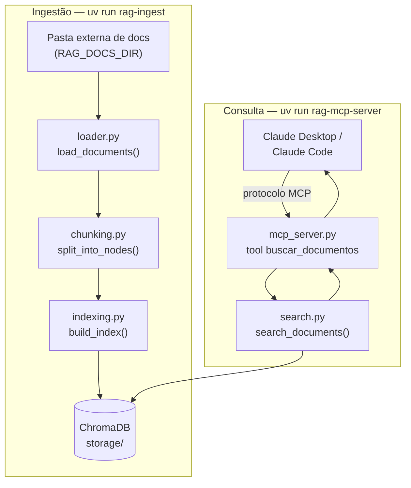

# rag-study

**Idioma:** [English](README.md) | **Português** (você está aqui)

---

### Resumo

`rag-study` é um projeto pessoal de estudo de RAG (Retrieval-Augmented Generation) e, ao mesmo tempo, uma ferramenta real: um **servidor MCP** local que permite ao Claude (Desktop e Claude Code) buscar semanticamente numa pasta pessoal de documentos — majoritariamente PDFs — usando embeddings locais e um banco vetorial local.

O projeto tem dois objetivos simultâneos:

- **Aprender** ferramental Python moderno e a mecânica central de um pipeline de RAG (leitura de documentos, chunking, embeddings, busca vetorial), construindo cada peça do zero em vez de esconder tudo atrás de uma chamada mágica de framework.
- **Ser útil** no dia a dia: perguntar ao Claude sobre os próprios documentos, com respostas fundamentadas em trechos reais e a fonte citada.

**Nenhum código deste projeto chama a API paga da Anthropic.** O único ponto de integração com o Claude é o protocolo MCP — a assinatura do Claude Desktop/Claude Code que você já paga é quem consome a tool exposta por este servidor.

### Framework e Tecnologias

| Camada | Escolha | Motivo |
| --- | --- | --- |
| Linguagem | Python 3.11+ | |
| Gerenciador de pacotes/ambiente | [`uv`](https://docs.astral.sh/uv/) | Rápido, moderno, uma ferramenta só pra deps + venv + empacotamento |
| Framework de RAG | [LlamaIndex](https://docs.llamaindex.ai/) (`llama-index-core`) | Feito especificamente para RAG; API direta pra carregar documentos, dividir em chunks e buscar |
| Embeddings | `llama-index-embeddings-huggingface` (local, `sentence-transformers`) | 100% local, sem chave de API, sem limite de uso, documentos nunca saem da máquina |
| Banco vetorial | [ChromaDB](https://www.trychroma.com/) | Local, persistido em arquivo, sem servidor externo, muito usado no mercado |
| Servidor MCP | [`fastmcp`](https://github.com/jlowin/fastmcp) | Implementação standalone do FastMCP, ativamente desenvolvida |
| Testes | `pytest` | Fluxo TDD, `MockEmbedding` pra testes rápidos sem baixar modelo real |

### Diagrama do Projeto



### Funcionamento do Projeto

1. **Ingestão (manual, rodada sempre que os documentos mudam):**
   `uv run rag-ingest` lê todos os arquivos da pasta apontada por `RAG_DOCS_DIR`, extrai o texto (pulando — com aviso — qualquer arquivo que falhe, ex: um PDF corrompido ou escaneado sem OCR), divide em chunks com sobreposição, gera o embedding de cada chunk localmente, e persiste tudo numa coleção ChromaDB dentro de `storage/`.
2. **Consulta (via Claude, pelo MCP):**
   O Claude Desktop ou Claude Code sobe `uv run rag-mcp-server` como subprocesso e conversa com ele pelo protocolo MCP. Quando você faz uma pergunta que precisa dos seus documentos, o Claude chama a tool `buscar_documentos`; o servidor gera o embedding da pergunta, recupera os chunks mais próximos no ChromaDB e devolve com o nome do arquivo de origem. O Claude então responde com base nesses trechos.
3. **Se ainda não existir um índice**, a tool retorna uma mensagem clara pedindo pra rodar `rag-ingest` primeiro, em vez de quebrar.

### Estrutura do Projeto

```text
src/rag_study/
├── config.py       # Config.from_env() — lê variáveis de ambiente, valida RAG_DOCS_DIR, monta o modelo de embedding sob demanda
├── loader.py       # load_documents() — lê todos os arquivos da pasta de docs, pula os ilegíveis com um aviso
├── chunking.py     # split_into_nodes() — divide os Documents em TextNodes menores com sobreposição (SentenceSplitter)
├── indexing.py     # build_index() / load_index() — gera embeddings dos nodes e persiste/recarrega no ChromaDB
├── search.py       # search_documents() — recupera os chunks mais próximos de uma pergunta, levanta IndexNotFoundError se não houver índice
├── ingest.py       # run_ingestion() + main() — entry point de CLI (`rag-ingest`) que junta loader → chunking → indexing
└── mcp_server.py   # tool buscar_documentos + main() — entry point MCP (`rag-mcp-server`) que expõe a busca ao Claude
```

Cada módulo tem responsabilidade única e seu próprio arquivo de teste em `tests/` (`test_config.py`, `test_loader.py`, etc.).

### Boas Práticas Usadas no Projeto

- **src-layout** (`src/rag_study/`) — o pacote só é importado a partir da forma instalada (`uv init --package`), nunca sem querer a partir de arquivos soltos no diretório de trabalho.
- **Config como objeto de valor explícito** — `Config.from_env()` devolve um `@dataclass` congelado em vez de depender de variáveis globais no módulo, então não há estado escondido e os testes nunca precisam de `importlib.reload()`.
- **Injeção de dependência em vez de globais** — `embed_model`, `storage_dir` etc. são passados como parâmetro pra `build_index`/`search_documents`/etc., permitindo que os testes usem `MockEmbedding` em vez de baixar um modelo de verdade.
- **TDD** — cada módulo foi escrito teste-primeiro: teste falhando → implementação mínima → teste passando → commit.
- **Módulos de responsabilidade única** — leitura, chunking, indexação, busca e a camada MCP são cinco arquivos separados, cada um testável de forma independente.
- **Falhar de forma controlada, não travar** — documentos corrompidos são pulados com um aviso no console em vez de abortar a ingestão inteira; um índice ausente retorna uma mensagem amigável em vez de uma exceção não tratada.
- **Local-first / privacidade por padrão** — embeddings rodam na própria máquina, documentos nunca saem dela, e nenhuma API paga é chamada pelo código.

### Como Executar

Defina a pasta com seus documentos antes de rodar qualquer comando:

- Windows (PowerShell): `$env:RAG_DOCS_DIR = "C:\caminho\para\seus\documentos"`
- Bash: `export RAG_DOCS_DIR="/caminho/para/seus/documentos"`

Variáveis de ambiente opcionais (com valores padrão):

| Variável | Padrão | Descrição |
| --- | --- | --- |
| `RAG_STORAGE_DIR` | `storage` | Onde o índice ChromaDB é persistido |
| `RAG_EMBEDDING_MODEL` | `sentence-transformers/paraphrase-multilingual-MiniLM-L12-v2` | Modelo de embedding local |
| `RAG_CHUNK_SIZE` | `512` | Tamanho de cada chunk |
| `RAG_CHUNK_OVERLAP` | `50` | Sobreposição entre chunks |

**Indexe seus documentos** (rode sempre que adicionar/alterar arquivos):

```bash
uv run rag-ingest
```

**Rode o servidor MCP manualmente** (pra testar):

```bash
uv run rag-mcp-server
```

**Rode a suíte de testes:**

```bash
uv run pytest -v
```

**Conecte o Claude Desktop** — adicione ao `claude_desktop_config.json`:

```json
{
  "mcpServers": {
    "rag-study": {
      "command": "uv",
      "args": ["--directory", "CAMINHO_DO_PROJETO", "run", "rag-mcp-server"],
      "env": {
        "RAG_DOCS_DIR": "CAMINHO_DA_PASTA_DE_DOCUMENTOS"
      }
    }
  }
}
```

Reinicie o Claude Desktop após salvar.

**Conecte o Claude Code** — na pasta do projeto:

```bash
claude mcp add rag-study --scope project -- uv --directory "CAMINHO_DO_PROJETO" run rag-mcp-server
```

### Próximas Melhorias

- **OCR** para PDFs escaneados sem camada de texto extraível.
- **Reindexação incremental/automática** (observar a pasta de documentos em vez de rodar `rag-ingest` manualmente).
- **Busca híbrida** (busca por palavra-chave BM25 combinada com similaridade vetorial) pra melhorar o recall em termos/nomes exatos.
- **Citações com número de página**, não só o nome do arquivo de origem.
- **Suporte a múltiplas pastas/coleções**, pra permitir consultar conjuntos de documentos diferentes separadamente.
